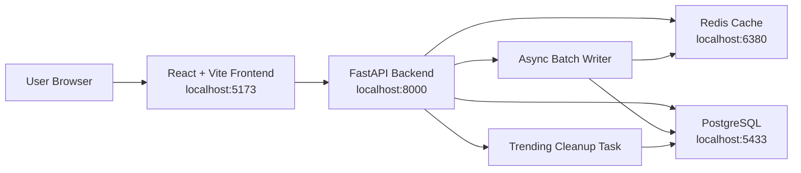

# TypeAhead Project Report

## 1. Architecture



The project is a containerized typeahead search suggestion system. Docker Compose starts four services:

- Frontend: React and Vite UI for typing queries, showing suggestions, and submitting searches.
- Backend: FastAPI application that serves suggestions, records searches, exposes cache debug information, and provides metrics.
- PostgreSQL: Primary persistent store for all-time query counts and recent searches.
- Redis: Cache layer used through logical distributed nodes and consistent hashing.

Request flow:

1. The user types a prefix in the frontend.
2. The frontend calls `GET /suggest?q=<prefix>`.
3. The backend normalizes the prefix and checks Redis through the cache manager.
4. On cache hit, suggestions are returned directly.
5. On cache miss, PostgreSQL is queried and results are cached with a TTL.
6. When the user submits a search, `POST /search` records it in an in-memory batch writer.
7. The batch writer periodically flushes aggregated counts to PostgreSQL and invalidates affected cache prefixes.

## 2. Dataset Source And Loading

The dataset is bundled inside the repository at:

```text
Backend/data/dataset.zip
```

The zip contains:

```text
dataset.txt
```

The dataset is a public dataset of user search session collection on kaggle - [text](https://www.kaggle.com/datasets/dineshydv/aol-user-session-collection-500k)

Loading instructions:

```bash
docker compose up -d --build
```

On backend startup, `Backend/entrypoint.sh` runs:

1. `alembic upgrade head`
2. `python -m src.db.seed`
3. `uvicorn src.main:app --host 0.0.0.0 --port 8000`

The seed script opens `data/dataset.zip`, reads `dataset.txt`, lowercases and aggregates duplicate queries in memory, and bulk inserts records into PostgreSQL using `asyncpg.copy_records_to_table`.

Observed local seed results:

- Unique queries aggregated: `1,244,495`
- First full seed observed: about `29.75 seconds`
- Restart with already-seeded database: about `7.46 seconds` for dataset read/check

## 3. API Documentation

Base URL:

```text
http://localhost:8000
```

Swagger documentation:

```text
http://localhost:8000/docs
```

### GET `/health`

Checks whether the API is running.

Response:

```json
{
  "status": "ok"
}
```

### GET `/suggest?q=<prefix>`

Returns up to 10 search suggestions for a prefix.

Example:

```bash
curl 'http://localhost:8000/suggest?q=app'
```

Response shape:

```json
{
  "prefix": "app",
  "ranking_mode": "trending",
  "suggestions": [
    {
      "query": "app",
      "count": 87,
      "recent_count": 1,
      "trending_score": 26.8
    }
  ]
}
```

### POST `/search`

Records a submitted search query.

Example:

```bash
curl -X POST 'http://localhost:8000/search' \
  -H 'Content-Type: application/json' \
  -d '{"query":"app"}'
```

Request body:

```json
{
  "query": "app"
}
```

Response:

```json
{
  "message": "Searched"
}
```

### GET `/cache/debug?prefix=<prefix>`

Shows which logical cache node owns a prefix and whether it is cached.

Example:

```bash
curl 'http://localhost:8000/cache/debug?prefix=app'
```

Response shape:

```json
{
  "prefix": "app",
  "cache_node": "node-2",
  "hit": true,
  "ttl_remaining_seconds": 300,
  "total_hits": 0,
  "total_misses": 8,
  "hit_rate": "0.0%"
}
```

### GET `/metrics`

Returns lightweight runtime metrics.

Response shape:

```json
{
  "cache_stats": [
    { "node_id": "node-0", "key_count": 1 },
    { "node_id": "node-1", "key_count": 1 },
    { "node_id": "node-2", "key_count": 0 },
    { "total_hits": 0, "total_misses": 7, "hit_rate": "0.0%" }
  ],
  "batch_buffer_size": 0,
  "db_pool_size": 5
}
```

## 4. Design Choices And Tradeoffs

### Docker-first setup

The project uses Docker Compose so reviewers can run the complete system with one command. This avoids manual setup for Python, Node, PostgreSQL, Redis, migrations, and dataset loading.

Tradeoff: Docker startup is heavier than running only a frontend, but it makes the assignment reproducible.

### PostgreSQL as the primary store

The `queries` table stores all-time query counts, and `recent_searches` stores append-only recent activity for trending.

Indexes used:

- `query text_pattern_ops` B-tree index for prefix searches like `LIKE 'app%'`
- `gin_trgm_ops` index for scalable text lookup support
- descending count index for popularity sorting
- indexes on recent search query and timestamp

Tradeoff: PostgreSQL is reliable and easy to inspect, but a very large production typeahead system may eventually need sharding, materialized prefix tables, or specialized search infrastructure.

### Cache-aside Redis design

The backend checks Redis first and falls back to PostgreSQL on cache miss. Cached values have a default TTL of 300 seconds.

Tradeoff: Cache-aside keeps the design simple and resilient. The cost is that the first request for a prefix still hits PostgreSQL.

### Consistent hashing over logical cache nodes

The cache manager creates multiple logical cache nodes on a single Redis instance using key prefixes like:

```text
cache:node-2:app
```

Prefixes are assigned to nodes using `uhashring` with virtual nodes.

Tradeoff: This demonstrates distributed cache routing without requiring multiple Redis containers. In production, each logical node could become an actual Redis instance.

### Batch writes for submitted searches

`POST /search` does not write every request directly to the database. It increments an in-memory counter and the batch writer periodically flushes aggregated updates.

Tradeoff: This improves write throughput and reduces database contention. The downside is that searches waiting in memory could be lost if the backend process crashes before the next flush.

### Trending score

Suggestions are ranked with:

```text
(all_time_count * alpha) + (recent_count * beta)
```

Default values:

- `alpha = 0.3`
- `beta = 0.7`
- recent window = 60 minutes

Tradeoff: This allows recent searches to influence ranking without losing historical popularity. The query is more expensive than all-time ranking because it joins against recent search counts.

## 5. Performance Report

Environment:

- Docker Compose on local machine
- FastAPI backend on port `8000`
- PostgreSQL 15 container
- Redis 7 container
- Dataset loaded from `Backend/data/dataset.zip`

Observed data loading:

- Dataset zip size: about `44 MB`
- Unzipped dataset file size: about `226 MB`
- Unique query rows: `1,244,495`
- First full seed: about `29.75 seconds`
- Restart with already-seeded database: about `7.46 seconds`

Observed API behavior:

- `GET /health` returned `200 OK`
- `GET /suggest?q=app` returned 10 suggestions from seeded data
- Backend logs showed a cache-miss database request for `q=app` around `47.78 ms`
- Repeated local `GET /suggest?q=app` timings:

```text
0.023047 s
0.002889 s
0.002318 s
0.002551 s
0.002071 s
```

Interpretation:

- The first measured request may include cache population or connection overhead.
- Warm requests were approximately 2-3 ms locally.
- Search submissions are fast because they write to the in-memory batch buffer first.
- Batch flushes occur every 5 seconds by default and update both all-time counts and recent-search rows.

Scalability notes:

- Read path scales through Redis caching and indexed PostgreSQL prefix queries.
- Write path scales better than direct writes because repeated submitted queries are aggregated before database flush.
- The current logical cache node setup demonstrates consistent hashing, but true horizontal scaling would require separate Redis instances and multiple backend replicas.
